## Projeto Web - Template Figma

Desenvolvimento: 
Ana Carolina de Almeida Boy - TURMA J
 Professor(a): Thalita Nunes

# Design Figma
### Paleta de Cores

### Tipografia

   

### Logotipos

  

  

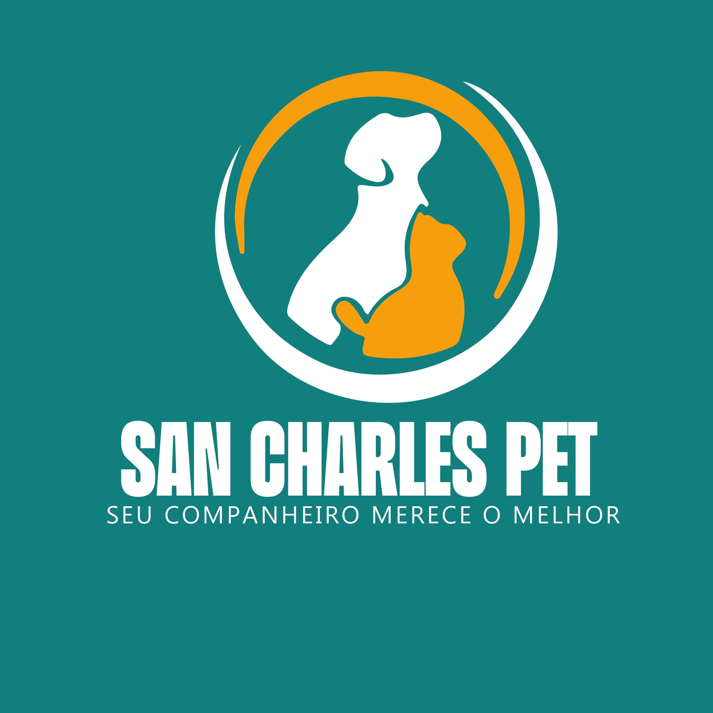
  
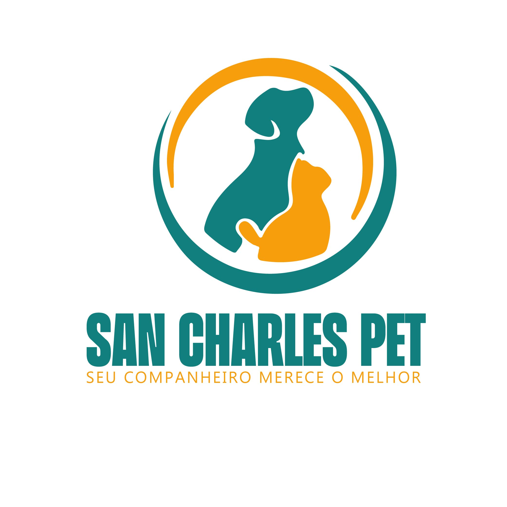
  

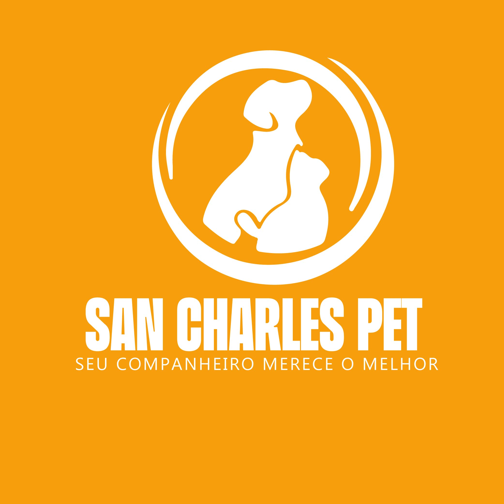
  

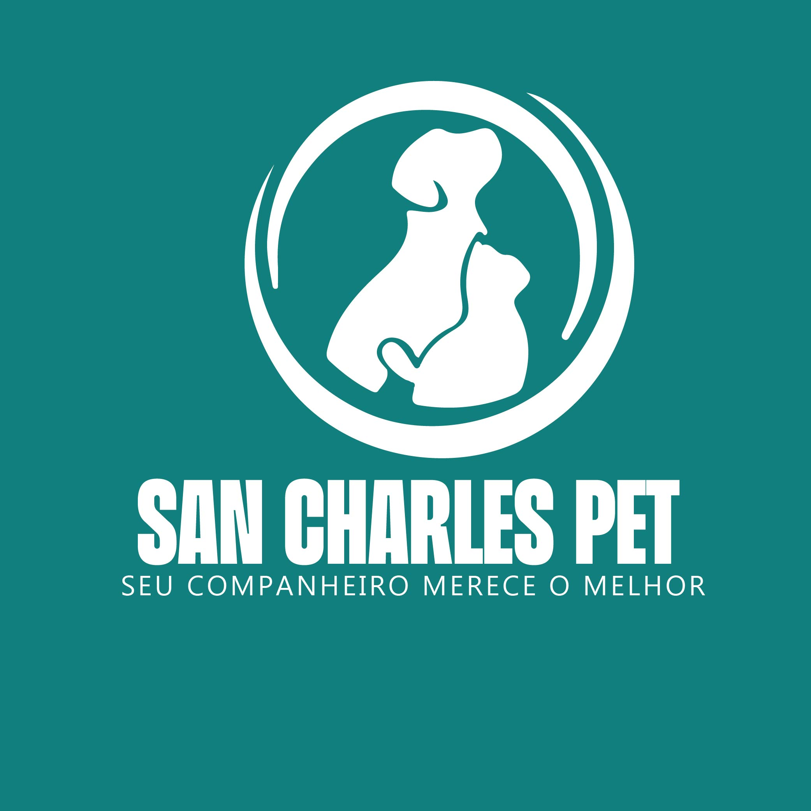
  

# Páginas
<h2> Início</h2>
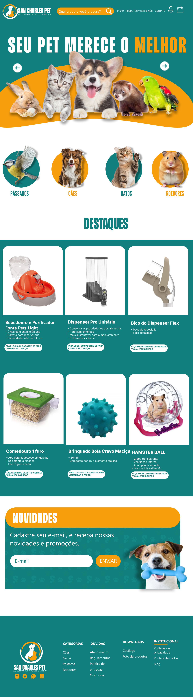
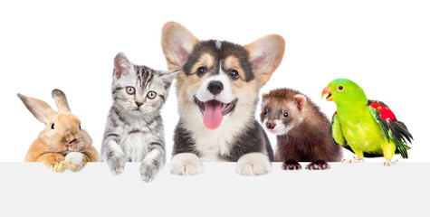

## Categorias
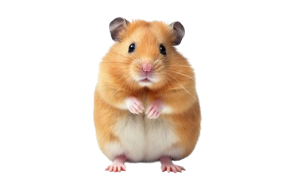
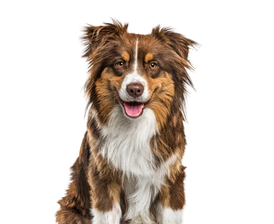

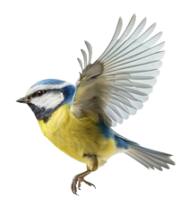
   

<h2> Produtos -> Cães</h2>
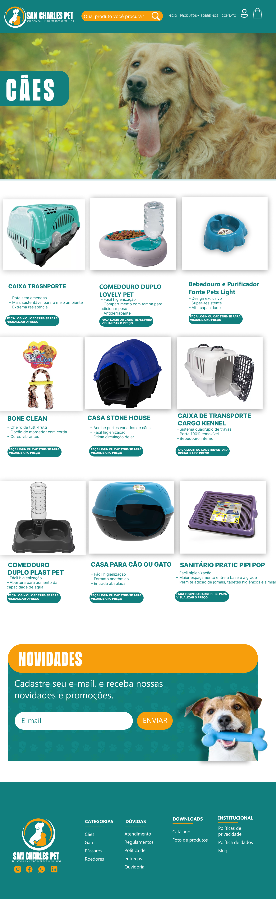
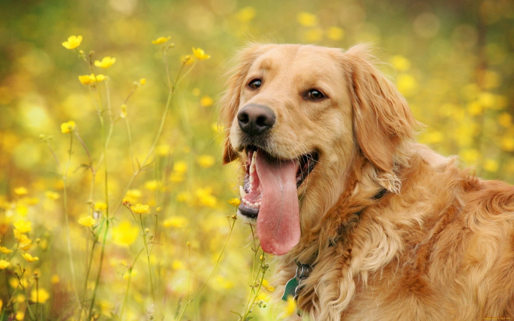

<h2> Produtos -> Gatos</h2>
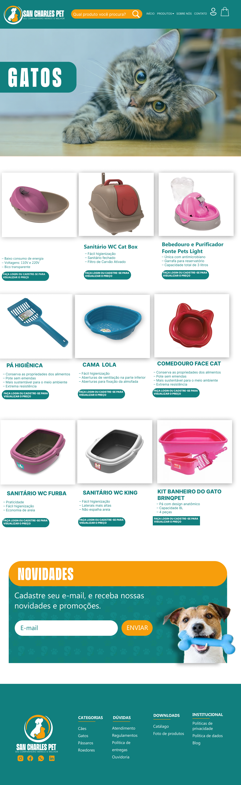

   

<h2> Produtos -> Pássaros</h2>
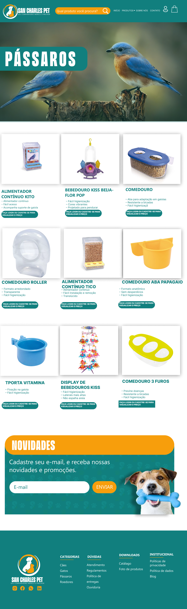

   

<h2> Produtos -> Roedores</h2>
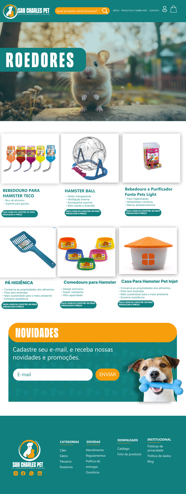
   

<h2> Produtos -> Sobre Nós</h2>
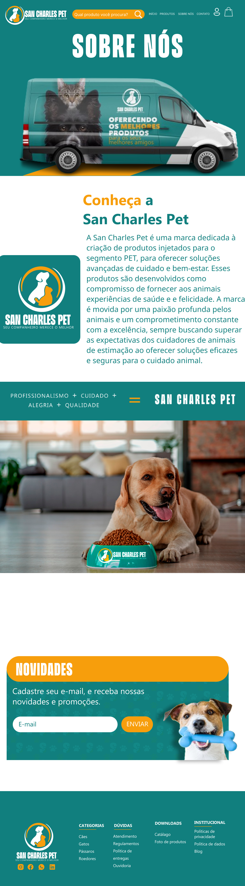
   

<h2> Produtos -> Contato</h2>
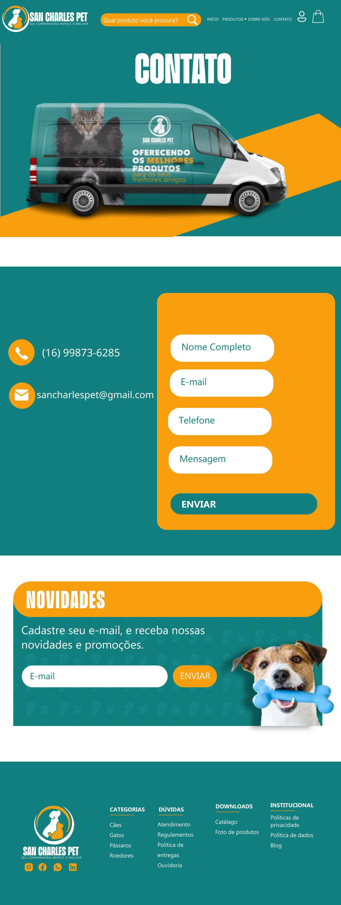
   

<h2> Produtos -> Login</h2>
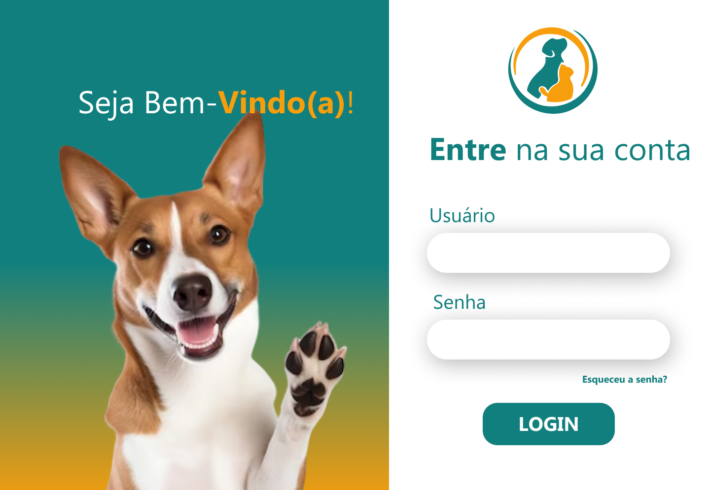

   

# Ícones

  

  

  

  

  

  

  
